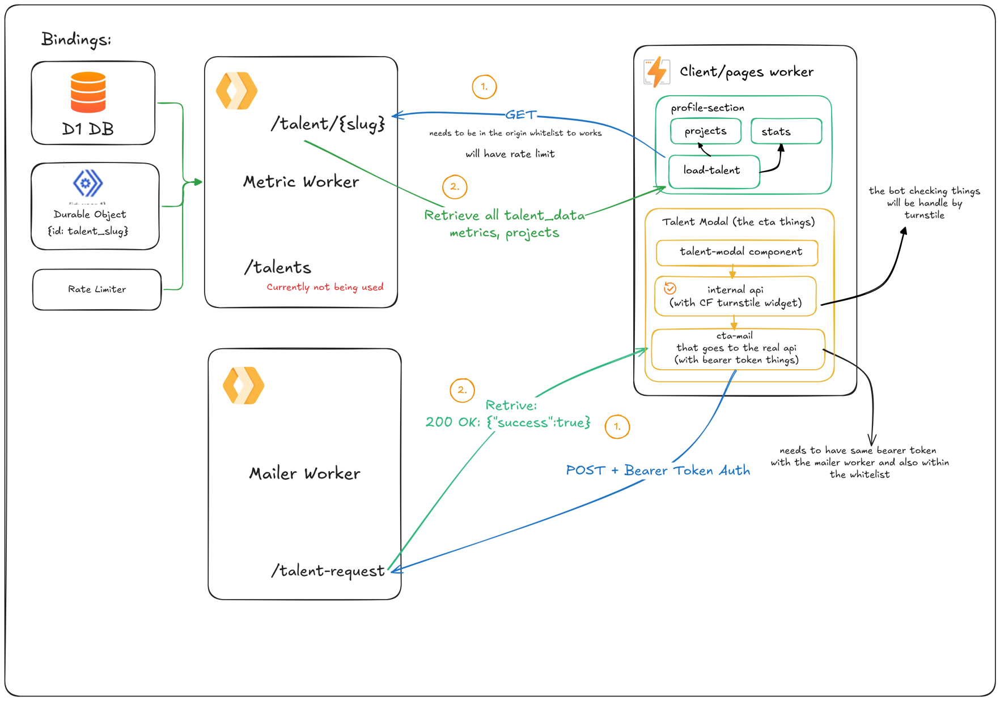

# Workshop Riset Informatika Website


Welcome to the official repository for the Workshop Riset Informatika (WRI) website. This project is a modern, high-performance web application built with [Astro](https://astro.build) and [Svelte](https://svelte.dev), designed to showcase WRI's activities, articles, and community.

This repository is a continuation and update of the previous website located at [wrideveloper/web-wri](https://github.com/wrideveloper/web-wri).

## 🏗️ System Design

This project utilizes a modern jamstack architecture optimized for performance and ease of development.



## 🚀 Tech Stack

- **Framework**: [Astro](https://astro.build) (v5) - For static site generation and island architecture.
- **UI Library**: [Svelte](https://svelte.dev) - For interactive components.
- **Styling**: [Tailwind CSS](https://tailwindcss.com) (v4) - For utility-first styling.
- **Deployment**: [Cloudflare Pages](https://pages.cloudflare.com) - Optimized for edge deployment.
- **Package Manager**: [Bun](https://bun.sh) - Recommended for fast installations.
- **Internationalization**: Native Astro i18n (English & Indonesian).

## 🛠️ Prerequisites

Before you begin, ensure you have the following installed:

- [Bun](https://bun.sh/) (v1.0 or higher) - _Preferred package manager_

## 📦 Installation

1. **Clone the repository**

   ```bash
   git clone https://github.com/wrideveloper/wridev.id.git
   cd wridev.id
   ```

2. **Install dependencies**
   ```bash
   bun install
   ```

## 💻 Development

Start the local development server:

```bash
bun dev
```

The site will be available at `http://localhost:4321`.

## ✍️ Adding Content

Since this is a static site content-driven by Markdown, adding an article is as simple as creating a file.

1.  Create a new Markdown file in `src/content/articles/`.
2.  Add the required Frontmatter (title, description, image, author, etc.).
3.  Write your content in Markdown.

For detailed instructions and Frontmatter templates, please refer to the [Contributing Guide](./CONTRIBUTING.md#writing-articles).

## 🏗️ Building for Production

To create a production build (optimized for Cloudflare):

```bash
bun run build
```

The output will be in the `dist/` directory.

You can preview the production build locally:

```bash
bun run preview
```

## 🌍 Environment Variables

This project uses environment variables for configuration. Create a `.env` file in the root directory if needed, or configure them in your deployment platform (e.g., Cloudflare Pages).

Key variables used (see `astro.config.mjs`):

- `PUBLIC_TURNSTILE_SITE_KEY`
- `TURNSTILE_SECRET_KEY`
- `METRIC_WORKER_URL`
- `CTA_WORKER_URL`
- `CTA_PUBLIC_API_TOKEN`

## 🤝 Contributing

We welcome contributions! Please see [CONTRIBUTING.md](./CONTRIBUTING.md) for details on how to get started, our code of conduct, and the submission process.

## 📄 License

This project fits the following licensing model, maintaining the spirit of open education and open source:

- **Source Code**: [GNU General Public License v3.0 (GPLv3)](./LICENSE.GPL-3.0) - Ensures the code remains free and open source.
- **Content (Articles, Assets)**: [Creative Commons Attribution 4.0 International (CC BY 4.0)](./LICENSE.CC-BY-4.0) - Allows sharing and adaptation with appropriate credit.

See the specific license files for full legal text.
